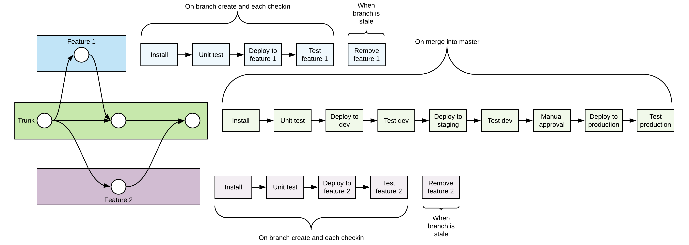

# CI/CD

This project is setup to use [Trunk based development](https://trunkbaseddevelopment.com/), where changes to master are automatically pushed to long-lived environments/stages and changes in each feature branch are automatically pushed to an ephemeral environment dedicated to that feature branch.

Consider using a tool like [Odin](https://github.com/manwaring/odin) to automatically remove stale branches.

## Stage setup

The table below shows how each stage is setup and deployed, and how those deployments fit in with GitHub branches, CircleCI config, and AWS accounts.

| Stage         | Git branch       | Deploy          | Current CircleCI context | Ideal CircleCI context | Current AWS account | Ideal AWS account    | Duration  |
| ------------- | ---------------- | --------------- | ------------------------ | ---------------------- | ------------------- | -------------------- | --------- |
| [branch-name] | [feature-branch] | Automatic       | pariveda-serverless-aws  | dev/sandbox-aws        | pariveda-serverless | [client]-dev/sandbox | Ephemeral |
| dev           | master           | Automatic       | pariveda-serverless-aws  | dev/sandbox-aws        | pariveda-serverless | [client]-dev/sandbox | Permanent |
| staging       | master           | Automatic       | pariveda-serverless-aws  | staging-aws            | pariveda-serverless | [client]-staging     | Permanent |
| prod          | master           | Manual approval | pariveda-serverless-aws  | prod-aws               | pariveda-serverless | [client]-prod        | Permanent |
