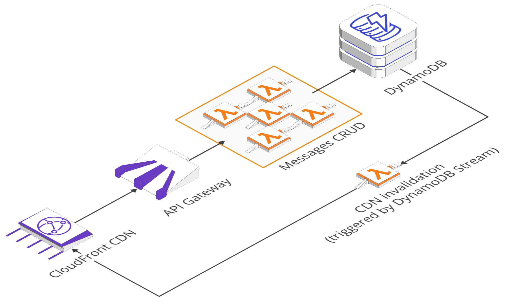
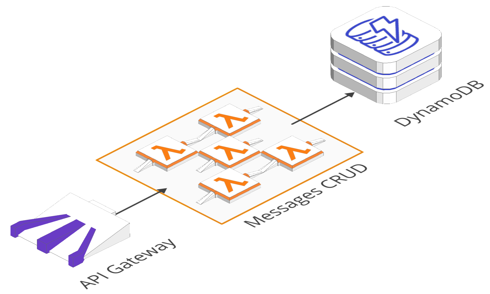
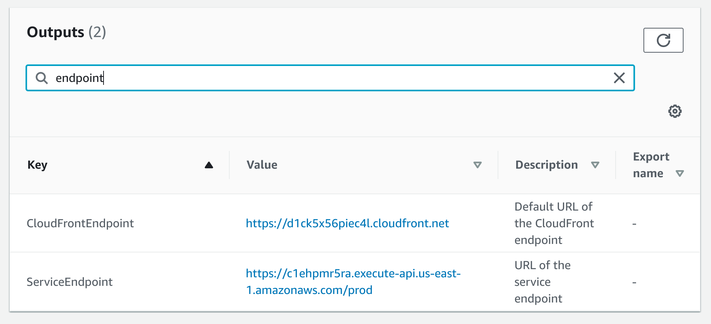

<p align="center">
  
  
</p>

[![build]][build-url] [![coverage]][coverage-url] [![dependabot]][dependabot-url] [![dependencies]][dependencies-url] [![dev-dependencies]][dev-dependencies-url] [![license]][license-url]

# Serverless API starter template

This project is a GitHub template you can initiate new projects with. Its aim is to provide a robust serverless development, deployment, and testing experience out-of-the-box so that developers can focus on writing business logic and develop their serverless app with confidence.

If you find yourself making changes to the default setup in your project please consider making those same changes in this template repository so that future developers can benefit from better ways of doing things.

1. [Template overview](#template-overview)
1. [3rd party setup & configuration](#3rd-party-setup--configuration)
   1. [AWS](#aws-setup--configuration)
   1. [Lumigo](#lumigo-setup--configuration)
   1. [CircleCI](#circleci-setup--configuration)
1. [Local setup & deployment](#local-setup--deployment)
1. [Application architecture](#architecture)
1. [CI/CD overview](#cicd)
1. [Project stats](#project-stats)

# Template overview

### How to use this template

1. [Follow the steps here][template guide] to create a new repo/project from this template
1. Modify the code as-needed for your new service (including this README!)

[template guide]: https://help.github.com/en/github/creating-cloning-and-archiving-repositories/creating-a-repository-from-a-template

### Tools & technologies used

- [Serverless Framework][sls framework] for managing infrastructure as code (including helpful abstractions on top of [CloudFormation][cf docs]) and as a CLI for scripted deployments
- [TypeScript][typescript] for a better JavaScripting experience
- [Jest][jest] for unit and e2e tests
- [ESLint][eslint] and [Prettier][prettier] for code rules and styling
- [CircleCI][circle] config for CI/CD
- [Lumigo][lumigo] for serverless monitoring and alerting
- A handful of helpful [plugins for the Serverless Framework][sls plugins]
- Examples of using the [AWS JavaScript SDK][aws sdk] to access deployed resources like DynamoDB

[sls framework]: https://serverless.com/framework/docs/
[cf docs]: https://docs.aws.amazon.com/cloudformation/index.html
[sls plugins]: https://github.com/serverless/plugins
[typescript]: https://www.typescriptlang.org/
[jest]: https://jestjs.io/
[eslint]: https://eslint.org/
[prettier]: https://prettier.io/
[circle]: https://circleci.com/
[lumigo]: https://lumigo.io/
[aws sdk]: https://docs.aws.amazon.com/AWSJavaScriptSDK/latest/

### Key limitations

- [Lambda limits][lambda limits]
- Serverless Framework works best with CloudFormation, see [CloudFormation limits][cf limits]
- [CloudFront limits][cloudfront limits]
- [DynamoDB limits][dynamo limits]

[lambda limits]: https://docs.aws.amazon.com/lambda/latest/dg/limits.html
[cf limits]: https://docs.aws.amazon.com/en_pv/AWSCloudFormation/latest/UserGuide/cloudformation-limits.html
[cloudfront limits]: https://docs.aws.amazon.com/en_pv/AmazonCloudFront/latest/DeveloperGuide/cloudfront-limits.html
[dynamo limits]: https://docs.aws.amazon.com/en_pv/amazondynamodb/latest/developerguide/Limits.html

### Template TODOs

- Add a [custom Lambda Authorizer][lambda auth] function to validate that calls are from authenticated/authorized users
- Add encrypted environment variables using KMS or SSM

[lambda auth]: https://serverless.com/framework/docs/providers/aws/events/apigateway/#http-endpoints-with-custom-authorizers

# 3rd party setup & configuration

### AWS setup & configuration

To deploy the application to AWS you'll need an account with access credentials configured locally - see the [Serverless Framework credentials guide][sls creds]. Setting up the [full AWS CLI][aws cli] and [configuring access via profiles][aws profiles] is recommended, as it will allow you to access AWS resources directly when needed.

[sls creds]: https://serverless.com/framework/docs/providers/aws/guide/credentials/
[aws cli]: https://aws.amazon.com/cli/
[aws profiles]: https://docs.aws.amazon.com/cli/latest/userguide/cli-configure-profiles.html

### Lumigo setup & configuration

This application is currently setup with [Lumigo][lumigo] as a serverless monitoring and logging solution. To package and deploy the application you'll either need to setup an account and provide a Lumigo access token as environment variable (or `.env` file - see Application Setup below).

Follow these instructions for [setting up your Lumigo account][lumigo setup] and [configuring the Lumigo serverless plugin][lumigo sls].

If you don't want to use Lumigo or want to get started without it just comment out the Lumigo plugin in `serverless.yml`, and optionally comment out the Lumigo-specific configurations:

```yml
plugins:
  - serverless-webpack
  - serverless-cloudformation-resource-counter
  - serverless-plugin-iam-checker
  - serverless-plugin-test-helper
  - serverless-prune-plugin
  # - serverless-lumigo

# (commenting out the custom config is optional)
custom:
  ...
  # https://github.com/lumigo-io/serverless-lumigo-plugin
  # lumigo:
  # token: ${env:LUMIGO_TOKEN}
  # nodePackageManager: npm
```

[lumigo]: https://lumigo.io/
[lumigo setup]: https://docs.lumigo.io/docs
[lumigo sls]: https://github.com/lumigo-io/serverless-lumigo-plugin

### CircleCI setup & configurations

This application is setup with CircleCI for testing and deployments. See [their documentation][circle setup] for steps on getting started.

[circle setup]: https://circleci.com/docs/2.0/getting-started/

# Local setup & deployment

**Setup local environment**

If using Lumigo, create a `.env` file with the following:

```
LUMIGO_TOKEN=<token>
```

**Install dependencies**

```bash
npm i
```

**Generate and view OpenAPI docs**

```bash
# Generate OpenAPI documentation
npm run generate-docs

# Run a live server at localhost:8080
npm run serve-docs
```

**Deploy application to AWS\***

```bash
# Using your default AWS profile
npm run deploy

# Using a named AWS profile to a specific stage
npm run deploy -- --aws-profile [PROFILE] --stage [STAGE]
```

_\*Note that deploying the application for the first time to a permanent stage (prod, staging, dev) can take up to 1 hour. This is because the application makes use of CloudFront for CDN-level API caching, and when CloudFront creates a new distribution it takes a long time. **This means that when CircleCI is deploying the application to a permanent stage for the first time it will fail due to a CircleCI timeout.** While CircleCI errors out the deployment continues via CloudFormation, and once the first deploy has completed subsequent deploys will complete much faster (assuming no changes to the CloudFront configurations)._

**Load snapshot data from [app/messages/sample-data/valid-messages.json](app/messages/sample-data/valid-messages.json) into the deployed DynamoDB table**

```bash
# Using your default AWS profile
npm run load-data

# Using a named AWS profile and targeting a specific stage
npm run load-data -- --aws-profile [PROFILE] --stage [STAGE]
```

**Run unit tests**

```bash
npm test
```

**Run e2e tests\***

```bash
npm run e2e-test
```

_\*Note that E2E tests can only be run after a successful deployment. The `serverless-plugin-test-helper` writes a file to the .serverless directory with the dynamically generated URLs for Api Gateway & CloudFront (if deployed to a permanent stage) which can then be loaded into the test file using the same library._

**Remove application from AWS**

```bash
# Using your default AWS profile
npm run remove

# Using a named AWS profile for a specific stage
npm run remove -- --aws-profile [PROFILE] --stage [STAGE]
```

_Note that all of the serverless commands are run through package.json scripts - this is so that people are working from a pinned version of the serverless framework as included in the package, as opposed to everyone using a global version that could span versions across multiple developer environments, potentially with slightly different side effects or other unintended differences that introduces unnecessary variance._

# Application architecture

### Permanent stages



Permanent stages (dev, staging, and prod) have two endpoints available for calling the API - one via API Gateway directly, and one via CloudFront. Note that calling the API Gateway directly bypasses CDN caching and so won't show performance benefits on subsequent calls.

### Ephemeral stages



Ephemeral stages have one endpoint available for calling the API - the one generated by API Gateway.



### API Endpoints

To see the endpoints check the output section of the deployed CloudFormation stack. You can view them in the [CloudFormation console][cf console] or via the AWS CLI, etc.
[cf console]: https://console.aws.amazon.com/cloudformation/home?region=us-east-1#/stacks

### API documentation

The api documentation is generated with swagger and hosted on a [repo-specific GitHub page][doc url].

[doc url]: https://pariveda-accelerators.github.io/serverless-api-typescript

# CI/CD

For detailed information on how CI/CD works across branches and AWS accounts see [the .circleci README here](.circleci)

# Project stats

```bash
-------------------------------------------------------------------------------
Language                     files          blank        comment           code
-------------------------------------------------------------------------------
TypeScript                      20             94            158            653
YAML                             6             41             24            453
Markdown                         3            115              0            230
JSON                             4              0              0            166
JavaScript                       5              1              1             95
HTML                             1              1              4             20
-------------------------------------------------------------------------------
SUM:                            39            252            187           1617
-------------------------------------------------------------------------------
```

Generated using `yarn run project-stats`

<!-- badge icons -->

[coverage]: https://flat.badgen.net/codecov/c/github/pariveda-accelerators/serverless-api-typescript/?icon=codecov
[license]: https://flat.badgen.net/github/license/pariveda-accelerators/serverless-api-typescript
[build]: https://flat.badgen.net/circleci/github/pariveda-accelerators/serverless-api-typescript/master/?icon=circleci
[dependabot]: https://flat.badgen.net/dependabot/pariveda-accelerators/serverless-api-typescript/?icon=dependabot&label=dependabot
[dependencies]: https://flat.badgen.net/david/dep/pariveda-accelerators/serverless-api-typescript
[dev-dependencies]: https://flat.badgen.net/david/dev/pariveda-accelerators/serverless-api-typescript/?label=dev+dependencies

<!-- badge urls -->

[coverage-url]: https://codecov.io/gh/pariveda-accelerators/serverless-api-typescript
[license-url]: https://github.com/pariveda-accelerators/serverless-api-typescript
[build-url]: https://circleci.com/gh/pariveda-accelerators/serverless-api-typescript
[dependabot-url]: https://flat.badgen.net/dependabot/pariveda-accelerators/serverless-api-typescript
[dependencies-url]: https://david-dm.org/pariveda-accelerators/serverless-api-typescript
[dev-dependencies-url]: https://david-dm.org/pariveda-accelerators/serverless-api-typescript?type=dev
