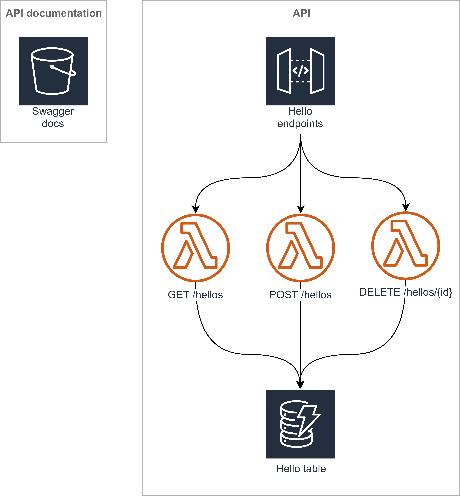

  &nbsp;&nbsp;&nbsp;&nbsp;
  &nbsp;&nbsp;
  

[![build]][build-url] [![coverage]][coverage-url] [![dependabot]][dependabot-url] [![dependencies]][dependencies-url] [![dev-dependencies]][dev-dependencies-url] [![license]][license-url]

# Serverless API TypeScript starter

A serverless api typescript starter for use as a template.

# Architecture

  

<!-- badge icons -->

[coverage]: https://flat.badgen.net/codecov/c/github/pariveda-accelerators/serverless-api-typescript/?icon=codecov
[license]: https://flat.badgen.net/github/license/pariveda-accelerators/serverless-api-typescript
[build]: https://flat.badgen.net/circleci/github/pariveda-accelerators/serverless-api-typescript/master/?icon=circleci
[dependabot]: https://flat.badgen.net/dependabot/pariveda-accelerators/serverless-api-typescript/?icon=dependabot&label=dependabot
[dependencies]: https://flat.badgen.net/david/dep/pariveda-accelerators/serverless-api-typescript
[dev-dependencies]: https://flat.badgen.net/david/dev/pariveda-accelerators/serverless-api-typescript/?label=dev+dependencies

<!-- badge urls -->

[coverage-url]: https://codecov.io/gh/pariveda-accelerators/serverless-api-typescript
[license-url]: https://github.com/pariveda-accelerators/serverless-api-typescript
[build-url]: https://circleci.com/gh/pariveda-accelerators/serverless-api-typescript
[dependabot-url]: https://flat.badgen.net/dependabot/pariveda-accelerators/serverless-api-typescript
[dependencies-url]: https://david-dm.org/pariveda-accelerators/serverless-api-typescript
[dev-dependencies-url]: https://david-dm.org/pariveda-accelerators/serverless-api-typescript?type=dev
